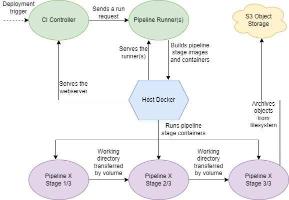

> **An extremely simple containerized CI server.**

# Ecosystem



**The Candor ecosystem is straightforward, and entirely containerized.**


Docker runs on the host machine(s) of the controller and pipeline runner(s).
The controller's panel and API runs as a container. 
The pipeline runner(s) run(s) as a container.
The controller keeps track of the semantics of pipelines, their users and permissions, etc.

When the controller should run the pipeline, it chooses an available runner.
It then sends the runner a blueprint of the tasks to perform for this pipeline run.
The runner builds the required images for each stage on the host Docker.
Next, it creates a volume for the run of the pipeline.
With the created images, it runs a container per stage of the pipeline, whereby the working directory is mounted on the shared volume.
Optionally, after the pipeline has passed, **files can be archived to S3** from the working directory of the last stage.
Lastly, all created images, containers, volumes, etc. get destroyed, even in the case of errors.

## Pipeline Philosophy.

- A pipeline may have multiple **stages**, which will be executed one after another.
- Pipeline stages all perform work in a single **working directory**, which gets passed from one stage to the next.
- If a stage **fails**, all subsequent stages are **skipped** and the pipeline fails.
- If the pipeline or a stage **errors**, all subsequent stages are **skipped** as well, and the pipeline also fails.
- If the pipeline **passes**, select files from the working directory may be permanently **archived**.

## Components

Candor consists of multiple components, which all play an important role in the ecosystem.
Although Candor is in an encosystem, **it is entirely possible to pick and choose applicable components**.
For example, a single pipeline runner can be used without its corresponding controller.
Or, custom runners can be used in place of the provided one with the same CI controller.

# CI Controller 

**The CI controller is both a web panel and API.**
Under the hood, it is a command line tool, capable of modifying the state of the ecosystem.
Very minimal information is reflected on the dashboard, in order to keep everything simple and to avoid clutter.

The controller's backend is written in *TypeScript*, using *Express.js*, *TypeORM* and a *PostgreSQL* database.
The controller's frontend is written in *Svelte*.

# Runner

**The runner is at the heart of the ecossytem.**
It exposes a single endpoint that contains a pipeline plan, and the runner's job is to execute this plan.
Everything the runner does is containerized.

The runner is written in *TypeScript* using *Express.js*.

## Plans

A plan describes how the pipeline should function.
Plans are at their core written in JSON.

When sending a pipeline request to a runner, the following format is required:
```json
{
    "runId": "12345",
    "tag": "veryrandomtaghere",
    "plan": {}
}
```
The `runId` is optional (defaults to a random hex string).
If the pipeline is being triggered by a panel or something that has a run ID, this will force the runner to use this ID to make debugging easier.
The `tag` is also optional (defaults to "untagged"), and specifies some grouping of pipelines.
Multiple pipeline plans can have the same tag, or they can each have their own.

The following describes the current pipeline plan.

Field | Type | Nullable | Description
-- | -- | -- | --
stages | stage[] | No | A possibly empty array of pipeline stages.
archive | string[] | Yes | The paths of all the filenames that will be archived.

The following describes the current stage plan.

Field | Type | Nullable | Description
-- | -- | -- | --
name | string | No | The name of the stage.
image | string | No | The name of the Docker image to use for the stage.
runtime | string | Yes | The runtime for the container. Defaults to the default system runtime.
environment | string[] | Yes | A possibly empty array of `KEY=VALUE` environment variables.
script | string[] | Yes | A possibly empty array of shell commands to execute in the container.

## Archiving

At the end of the pipeline, any file can be archived from the working directory and uploaded to S3 storage.

Archived files will be uploaded to `tag/filename` in S3, where `tag` is the pipeline run's tag and `filename` is the base file name of the file to be archived. Note that when archiving, everything will be flattened: path structures in the working directory are disregarded. For example, `foo/bar.txt` and `baz/bar.txt` both resolve to `bar.txt` and will overwrite eachother. As a workaround, archived files should be renamed before achiving. Furthermore, if folders are specified, these will be skipped and not uploaded to S3.

## Container Runtimes

Pipeline containers do not get started with `--priveleged` nor do they have access to the Docker daemon.
In order to provide functionality to e.g. build and publish an image, Docker needs to run inside of Docker.
Such functionality is supported using third party runtimes like `sysbox`. 

Candor makes no assumption about runtimes. 
It is up to the host system to install and configure additional container runtimes if the default runtime does not meet system requirements or expectations.

# Bootstrap

The `bootstrap/` directory provides a super simple way to spin up a fully functioning Candor CI stack. 
This create the following.
- A locally hosted S3 server to handle archives.
- A single pipeline runner.
- A web server to serve the dashboard.
- A database server for the dashboard.

**Warning:** This exposes the Docker socket to the runner's container. 
If you believe this is not worth the risk, please run the runner on baremetal instead.