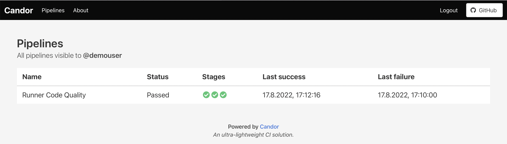
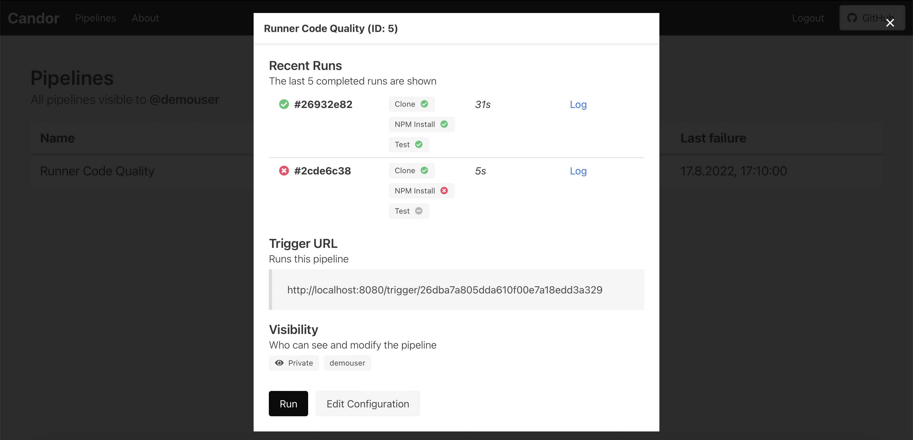
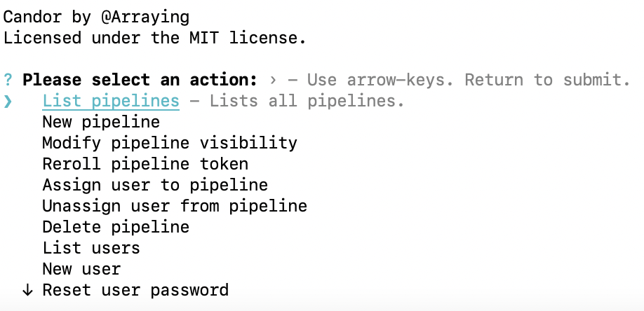

> **🚀 A mimimalistic containerized Continuous Integration ecosystem.**

# Features
- [🌊] Minimalistic from the ground up. Who says powerful can't be beautiful?
- [🖇️] One dashboard, as many runners as you want. 
- [🐳] Containerization with Docker at its core. Say goodbye to conflicting PATHs and dependencies.
- [🗄️] Artifact archiving to S3 storage.
- [🎨] Fast, responsive, modern design. Every piece of information is hand-selected and placed with purpose.
- [🖥️] Management performed through an elegant CLI, day-to-day business served through the web.

Convinced already? [Click me to get started]().

# Showcase

> 🏠 The home page contains an overview of all pipelines.

> 🛠️ A single pipeline can be inspected, modified and run.

> 📝 CRUD operations are performed through the interactive CLI.

# Installation & Documentation

Almost all documentation can be found in the [wiki](https://github.com/Arraying/Candor/wiki). If something is not covered in the wiki, feel free to [submit an issue](https://github.com/Arraying/Candor/issues/new) with your question.

Quick links:
- [Installation guide](https://github.com/Arraying/Candor/wiki/Installation).
- [Understanding the basic concepts](https://github.com/Arraying/Candor/wiki/Concepts).
- [Configuring dashboard and runners](https://github.com/Arraying/Candor/wiki/Configuration).
- [Hands-on first pipeline](https://github.com/Arraying/Candor/wiki/Pipelines-101).
- [API reference](https://github.com/Arraying/Candor/wiki/API).

# Roadmap

The current development roadmap is as follows:
- [⭐] Quality of life improvements to the config editor.
- [🐙] A GitHub status integration.
- [💾] The ability to use state of previous pipelines as base images.
- [🔌] A plugin system such that common pipeline steps such as Git clones can be abbreviated.
- [🔧] A fully-fledged web dashboard replacing the CLI.
- [📡] Updates and logs in real time.

Please note that this roadmap will most likely change as priorities shift or new ideas arise.

# Contributing

Coming soon.

# License

Copyright (c) 2022 Paul Huebner

Permission is hereby granted, free of charge, to any person obtaining a copy of this software and associated documentation files (the "Software"), to deal in the Software without restriction, including without limitation the rights to use, copy, modify, merge, publish, distribute, sublicense, and/or sell copies of the Software, and to permit persons to whom the Software is furnished to do so, subject to the following conditions:

The above copyright notice and this permission notice shall be included in all copies or substantial portions of the Software.

THE SOFTWARE IS PROVIDED "AS IS", WITHOUT WARRANTY OF ANY KIND, EXPRESS OR IMPLIED, INCLUDING BUT NOT LIMITED TO THE WARRANTIES OF MERCHANTABILITY, FITNESS FOR A PARTICULAR PURPOSE AND NONINFRINGEMENT. IN NO EVENT SHALL THE AUTHORS OR COPYRIGHT HOLDERS BE LIABLE FOR ANY CLAIM, DAMAGES OR OTHER LIABILITY, WHETHER IN AN ACTION OF CONTRACT, TORT OR OTHERWISE, ARISING FROM, OUT OF OR IN CONNECTION WITH THE SOFTWARE OR THE USE OR OTHER DEALINGS IN THE SOFTWARE.
